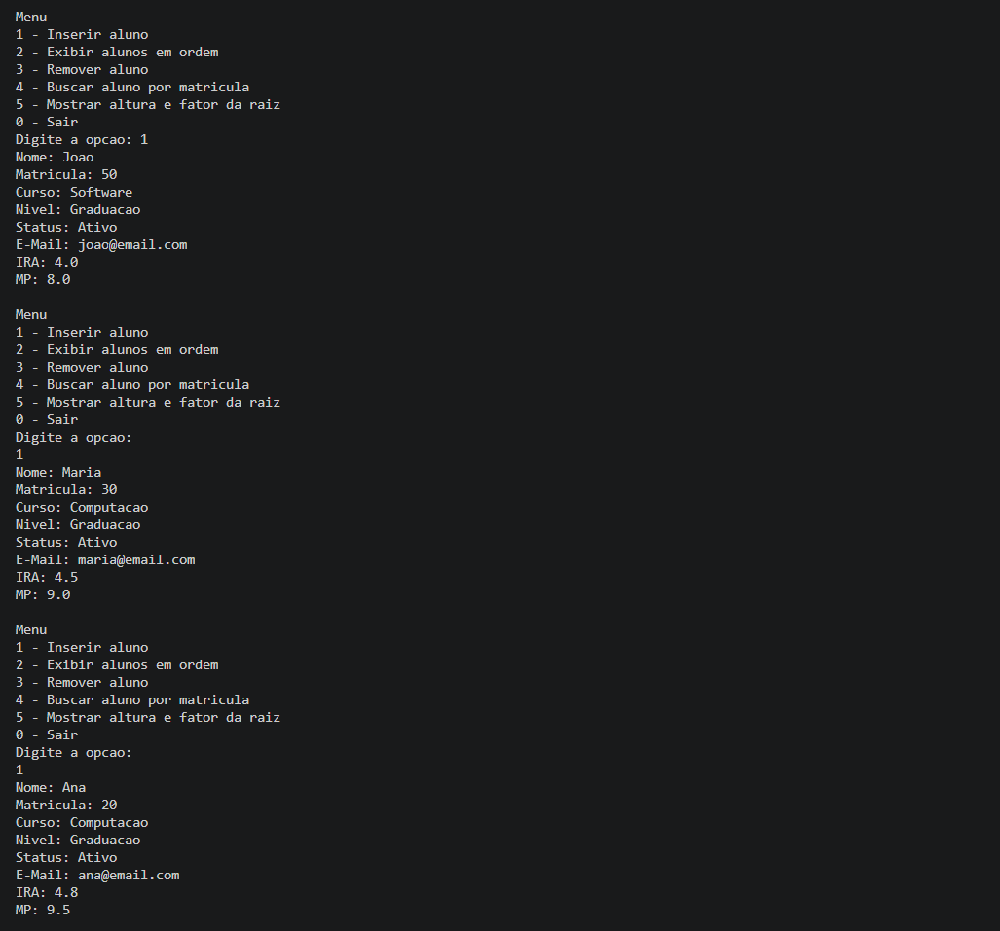
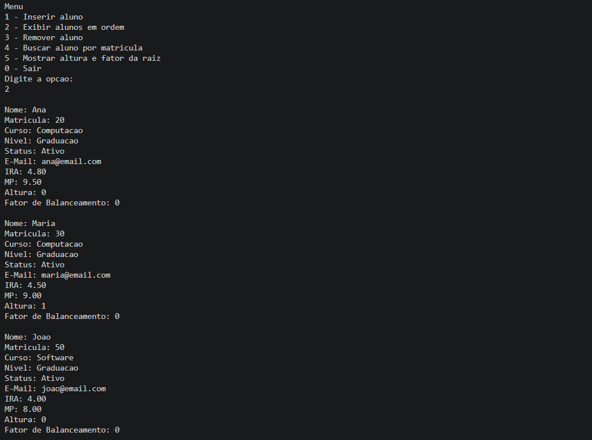
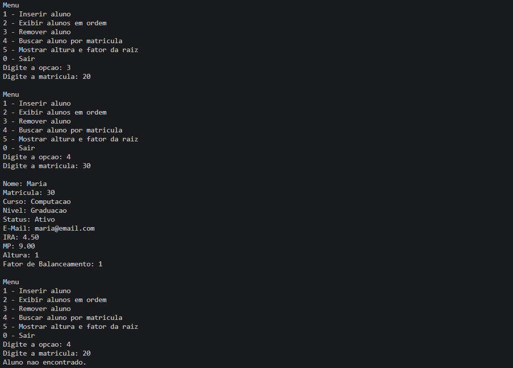

# G21_Arvore_EDA2-2026.1-

Número da Lista: 3
Conteúdo da Disciplina: Árvores Binárias de Busca Balanceadas (Estruturas de Dados II)

## Alunos

| Matrícula | Aluno                            |
| --------- | -------------------------------- |
| 202016604 | João Lucas Miranda de Sousa                   |

Este projeto implementa um sistema de cadastro de alunos com o objetivo de aplicar conceitos de estruturas de dados e árvores binárias de busca balanceadas. O sistema permite cadastrar, visualizar, remover e buscar alunos.

O cadastro de alunos é gerenciado por uma árvore binária de busca balanceada (AVL), onde cada aluno é indexado pela matrícula. Isso permite realizar inserções, remoções e buscas de forma eficiente, mantendo a estrutura balanceada e o acesso rápido aos registros.

## Screenshots


Tela de cadastro de aluno, onde é possível inserir matrícula, nome, curso, nível, status, email, IRA e média de provas.



Tela de exibição de alunos, mostrando a lista ordenada por matrícula.



Tela para buscar ou remover aluno pela matrícula informada.

## Linguagem Utilizada

O projeto foi desenvolvido utilizando a linguagem C.

## Requisitos do Sistema

Para executar o programa, é necessário:

- Compilador C (GCC recomendado)
- Sistema operacional: Linux, Windows ou macOS
- Terminal ou prompt de comando
## Compilar o Programa

No terminal, navegue até a pasta do projeto e execute:

```
gcc cadastroAvl.c -o cadastroAvl
```

Isso irá gerar o executável do programa.

## Uso

Após compilar, execute o programa com o comando:

No Linux/macOS:
```
./cadastroAvl
```

No Windows (cmd/powershell):
```
cadastroAvl.exe
```

Ao executar, será exibido um menu com as seguintes opções:
1 - Cadastrar aluno
2 - Mostrar alunos
3 - Remover aluno
4 - Buscar aluno pela matrícula
5 - Sair

### Descrição das Opções

**Cadastrar aluno**  
Permite inserir um novo aluno informando sua matrícula, nome, curso, nível, status, email, IRA e média de provas.

**Mostrar alunos**  
Exibe todos os alunos cadastrados em ordem por matrícula. O sistema utiliza percurso em ordem na árvore AVL para exibir os alunos ordenados por matrícula e mostra a altura de cada nó e o seu fator de balanceamento.

**Remover aluno**  
Remove um aluno existente usando a matrícula como chave.

**Buscar aluno pela matrícula**  
Localiza e exibe os dados do aluno correspondente à matrícula informada.

**Sair**  
Encerra o programa.

## Outros

- **Estruturas de dados utilizadas:**
    - Árvore binária de busca balanceada (AVL)

- **Funcionalidades implementadas:**
    - Cadastro de aluno
    - Listagem de alunos em ordem por matrícula
    - Remoção de aluno
    - Busca de aluno por matrícula
    - Balanceamento automático da árvore após inserções e remoções

 - **Vídeo de explicativo:**
    - Link: [Clique aqui para assistir](https://youtu.be/5r_StnGc7FU)
 
